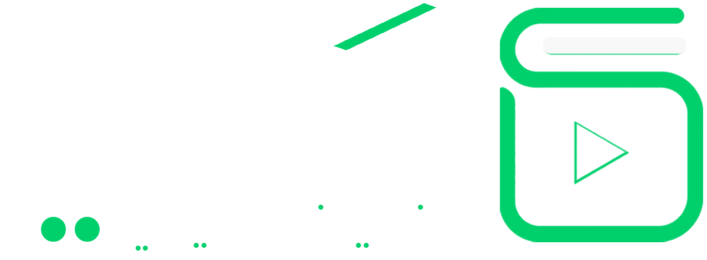

# أكاديمية سَعى | Saay Academy - صفحة الهبوط الرسمية (Landing Page)

<div align="center">
  
  <p><strong>"حجز المادة والمجموعة الدراسية بأبسط شكل.. وبأعلى دقة ومتابعة مستمرة"</strong></p>
  <p>📍 <strong>التغطية الحالية: جمهورية مصر العربية 🇪🇬 • الإمارات العربية المتحدة 🇦🇪</strong></p>
  <p>📱 <strong>رقم التواصل الرسمي وواتساب سَعى: <code>+20 10 97190466</code></strong></p>
</div>

---

## 📌 مراجعة وتدقيق شامل للمنهجية وتبسيط الـ UX

تم إجراء **تبسيط جذري لهيكل صفحة الهبوط وتحسين الـ UX** لتقليل التشتت والتركيز على القيمة الأساسية مع تحديث التسعير:

### 🎯 1. الحجز بنظام المجموعات الدراسية (Subject Groups Model):
* **الطالب يختار المادة والمنهج:** الطالب لا يختار معلماً بعينه من سوق مفتوح، بل يحدد دولته (مصر 🇪🇬 أو الإمارات 🇦🇪)، منهجه وصفه الدراسي، والمادة المطلوبة.
* **إدارة المجموعات في سَعى:** تنظم سَعى المجموعة الدراسية (**8 حصص شهرياً للمادة - بمعدل حصتين أسبوعياً**) وتسند المعلم المؤهل والمختبر لإدارتها.

### 👨‍🏫 2. حقيقة تقييم وتأهيل المعلمين (Honest Teacher Vetting):
* **الواقع الحقيقي:** معلمو سَعى هم معلمون وخريجون مصريون متمكنون وشغوفون، تقوم إدارة سَعى بإجراء **اختبارات تقييم دقيقة** لهم للتأكد من أسلوب شرحهم ومناسبتهم لمعايير سَعى قبل إسناد المجموعات.
* **المحاسبة المالية:** تتم محاسبة المعلم بالجنيه المصري بعائد يتراوح بين **100 إلى 150 ج.م للساعة التدريسية**.

### 📱 3. قنوات التواصل والدعم الرسمي:
* **رقم الواتساب والدعم الرسمي المعتمد:** **`+20 10 97190466`** (ربط مباشر عبر الزر العائم، وتذييل الصفحة، وشاشات تأكيد الحجز).
* **البريد الإلكتروني:** `support@saay.academy`.

---

## 💰 نموذج التسعير المعتمد للطلاب:

### 1. في جمهورية مصر العربية 🇪🇬:
* **الحصة الاستكشافية الأولى:** **مجانية بالكامل (0 ج.م)** لتجربة طريقة الشرح وجودة المنصة بدون أي التزام.
* **اشتراك المادة الشهري:** **300 جنيهاً مصرياً** شهرياً (يشمل **8 حصص تفاعلية للمادة** بمعدل حصتين أسبوعياً - بمتوسط **~37.5 ج.م للحصة**).
* **اشتراك الفصل الدراسي كاملاً:** **830 ج.م** (24 حصة شاملة مراجعات الامتحانات).

### 2. في دولة الإمارات العربية المتحدة 🇦🇪:
* **الحصة الاستكشافية الأولى:** **35 درهماً**.
* **سعر الحصة:** في نطاق **30 إلى 50 درهماً إماراتياً** للحصة.
* **اشتراك المادة الشهري:** **280 درهماً** شهرياً (يشمل **8 حصص تفاعلية** بمتوسط 35 درهم للحصة).
* **اشتراك الفصل الدراسي كاملاً:** **760 درهماً** (24 حصة).

---

## 🏗️ هيكل الصفحة بعد التبسيط (Streamlined UX)

تم تقليل الأقسام من 13 قسماً إلى **8 أقسام متسلسلة ومركزة**:
1. **شريط الإعلانات (Announcement Bar):** إعلان الحصة المجانية وضمان الرضا.
2. **الترويسة والتنقل (Navbar):** روابط مختصرة وزر مباشر للحجز وتواصل المعلمين.
3. **القسم الترحيبي (Hero Section):** عنوان واضح + وصف مبسط + زر الحجز المجاني وشريط المزايا الأساسية.
4. **كيف تعمل سَعى (How It Works):** رحلة الطالب في 3 خطوات بسيطة ومباشرة.
5. **الأسعار والخطط (Pricing Plans):** جدول تسعير تفاعلي لمصر والإمارات مع إبراز الحصة المجانية.
6. **آراء وتقييمات المشتركين (Testimonials):** قصص نجاح حقيقية موثقة.
7. **الأسئلة الشائعة (FAQ):** إجابات على كافة استفسارات أولياء الأمور والطلاب.
8. **الدعوة الختامية (Final CTA) والتذييل (Footer):** تأكيد الضمانات وروابط سريعة والدعم.

---

## 🛠️ التقنيات المستخدمة (Tech Stack)

* **Framework:** [Next.js 16 (App Router)](https://nextjs.org/) مع React 19.
* **Smooth Inertia Engine:** [Lenis Smooth Scroll](https://lenis.darkroom.engineering/).
* **Language:** TypeScript لضمان الأمان البرمجي ودقة البيانات.
* **Styling:** [Tailwind CSS v4](https://tailwindcss.com/) بنظام متغيرات التصميم (`CSS Variables`) والتوكنز التفاعلية بدون أي Hardcoded Colors.
* **Icons & Micro-animations:** مكتبة الأيقونات المتحركة التفاعلية [AnimateIcons (Lucide Animated Icons)](https://animateicons.in/icons/lucide) و [Motion / Framer Motion](https://motion.dev/).
* **Typography:** خط **Avenir Arabic** المعتمد (`AvenirArabic-Medium.otf`) مع دعم خطوط `Avenir Next Arabic`, `Rubik`, و `Cairo`.

---

## 🚀 التشغيل والتطوير المحلي (Getting Started)

```bash
# تثبيت الحزم
npm install

# تشغيل السيرفر المحلي
npm run dev

# بناء المشروع للإنتاج
npm run build
```
افتح المتصفح على: `http://localhost:3000`
